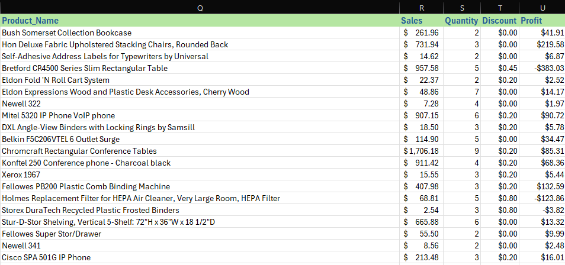

# Dataset Cleaning for Superstore Analysis

## Dataset Name: `superstore_raw`
- **Total number of columns**: 21  

## Purpose:
To clean the store dataset and prepare it for further analysis.

---

## 🔍 Before Cleaning

---

## 🛠️ Cleaning Steps

### 1. Format the Header
- Format **Row #1** for visual clarity.
- Remove spaces from column headers to ensure consistency.

---

### 2. Fix Inconsistencies in the Order Date Column
- Some dates in the **Order Date** column are stored as text. To correct this:
  1. Select the **Order Date** column.
  2. Go to the **Data** tab.
  3. Choose **Text to Columns**, select the date format `MM-DD-YYYY`, and apply.

---

### 3. Fix Inconsistencies in the Ship Date Column
- Apply the same steps used for the **Order Date** column to correct inconsistencies in the **Ship Date** column.

---

### 4. Format Sales, Discount, and Profit Columns
- Ensure the **Sales**, **Discount**, and **Profit** columns:
  - Are formatted as **Currency**.
  - Are limited to **two decimal places** for consistency.

---

### 5. Convert Negative Values in the Profit Column
- Some values are negative but shows in brackets
  - open Number tab.
  - Select Currency option from left menu.
  - select negative value format with '-' sign.

---

## ✅ Final Result:
The dataset is now clean, consistent, and ready for further analysis.

